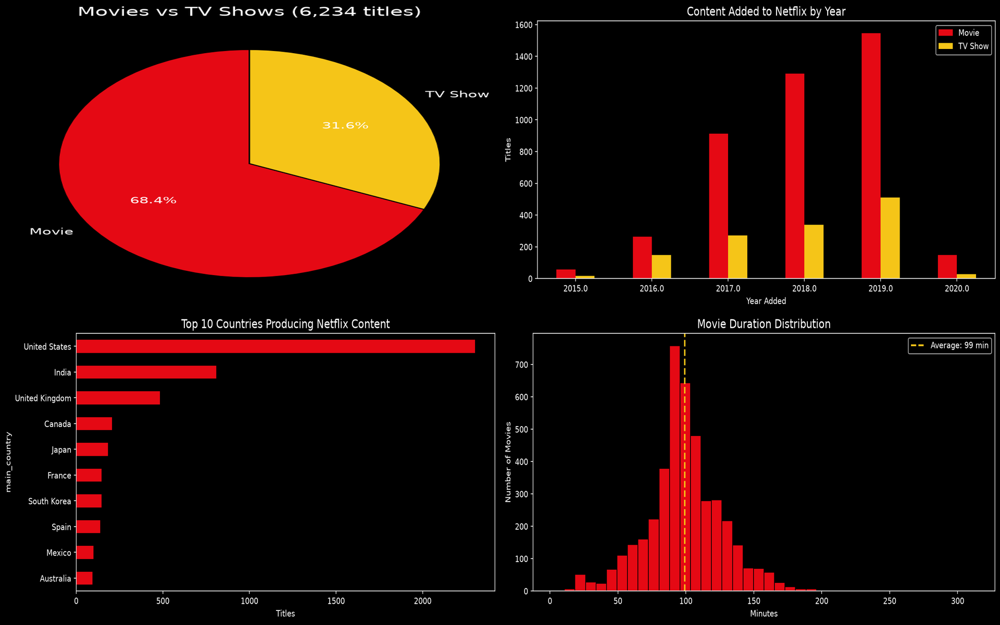

<h1 align="center">🎬 Netflix Data Analysis</h1>

<p align="center">
  
  
  
  
</p>

<p align="center">
  End-to-end exploratory analysis of <b>6,234+ Netflix titles</b> — from raw Kaggle data to interactive visualizations and catalog insights.
</p>

---

## 📊 Dashboard

<p align="center">
  
</p>

The dashboard above visualizes key trends across the full Netflix catalog:

| Panel | Insight |
|-------|---------|
| **Movies vs TV Shows** | Movies dominate at ~70% of the catalog vs ~30% TV Shows |
| **Content by Year** | Massive growth from 2015–2020, with 2019 as the peak year for additions |
| **Top Producing Countries** | United States leads by a wide margin, followed by India, UK, and Canada |
| **Movie Duration** | Most movies cluster around 90–120 min, with an average of ~100 minutes |

---

## 🗂 Project Structure

```
netflix-data-analysis/
├── netflix_titles.csv              # Kaggle dataset (shivamb/netflix-shows)
├── data_loader.py                  # Load, clean & feature engineering
├── charts.py                       # Visualization functions (one per question)
├── main.py                         # Pipeline orchestrator + summary stats
├── output/
│   └── dashboard.png               # README showcase dashboard
├── charts/                         # Generated PNG charts
│   ├── movies_vs_shows.png
│   ├── content_by_year.png
│   ├── top_countries.png
│   ├── top_genres.png
│   ├── movie_durations.png
│   ├── ratings.png
│   └── monthly_additions.png
├── requirements.txt                # Python dependencies
└── README.md
```

---

## ⚡ Quick Start

```bash
# Clone
git clone https://github.com/dawson-efraim/netflix-data-analysis.git
cd netflix-data-analysis

# Install
pip install -r requirements.txt

# Run analysis
python main.py
```

Charts are saved to `charts/` as PNGs and displayed interactively.

---

## 🔧 Features

- **Data cleaning & feature engineering** — Regex extraction for durations, country parsing, datetime handling
- **7 visualization types** — Pie charts, bar plots, histograms, line charts, horizontal bars
- **Dark theme styling** — Netflix-red and gold palette on dark background
- **OOP-ready architecture** — Clean separation: loader → chart functions → orchestrator
- **Summary statistics** — Auto-generated catalog overview printed to console

---

## 📈 Questions Answered

| # | Question | Chart |
|---|----------|-------|
| 1 | What's the split between Movies and TV Shows? | `movies_vs_shows.png` |
| 2 | How has content grown year over year? | `content_by_year.png` |
| 3 | Which countries produce the most Netflix content? | `top_countries.png` |
| 4 | What are the most common genres? | `top_genres.png` |
| 5 | How long is a typical Netflix movie? | `movie_durations.png` |
| 6 | Which ratings dominate the catalog? | `ratings.png` |
| 7 | Which months see the most new content? | `monthly_additions.png` |

---

## 🛠 Tech Stack

- **Python 3.10+**
- **Pandas** — Data manipulation, groupby, pivot tables
- **Matplotlib / Seaborn** — Visualization with custom styling
- **Regex** — Feature extraction from duration strings

---

## 📂 Data Source

| Source | Description |
|--------|-------------|
| [Netflix Shows on Kaggle](https://www.kaggle.com/datasets/shivamb/netflix-shows) | Public catalog of Netflix titles — movies, TV shows, directors, countries, genres |

---

<p align="center">
  <i>Built as part of a data science learning journey.</i><br>
  <sub>Raw Kaggle data → Clean analysis → Polished insights</sub>
</p>
